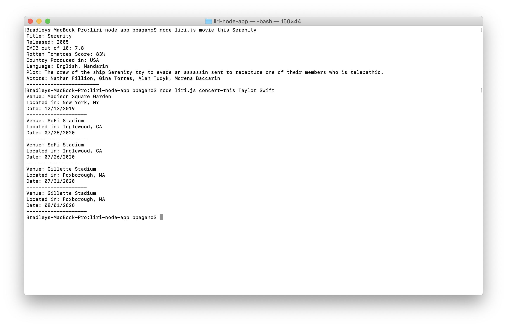
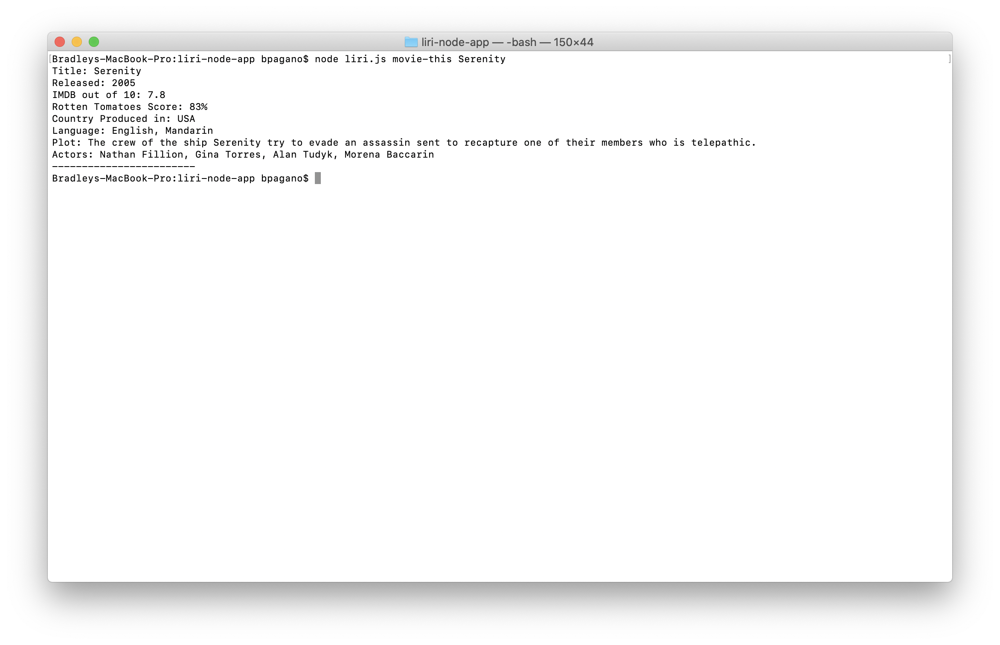
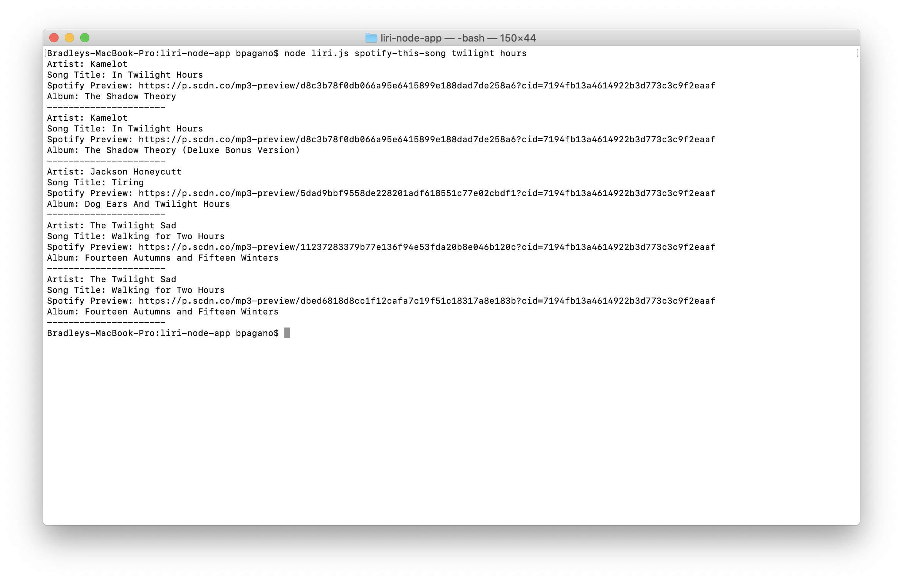
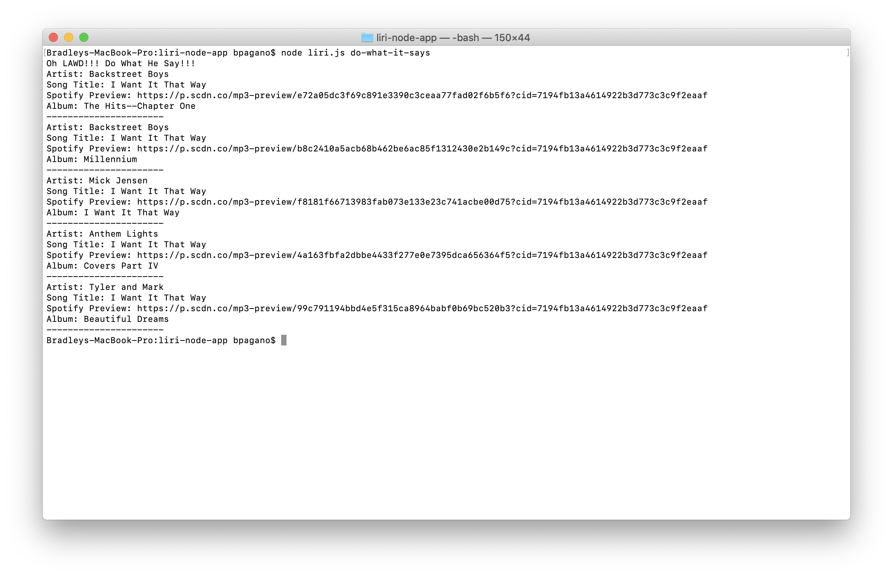
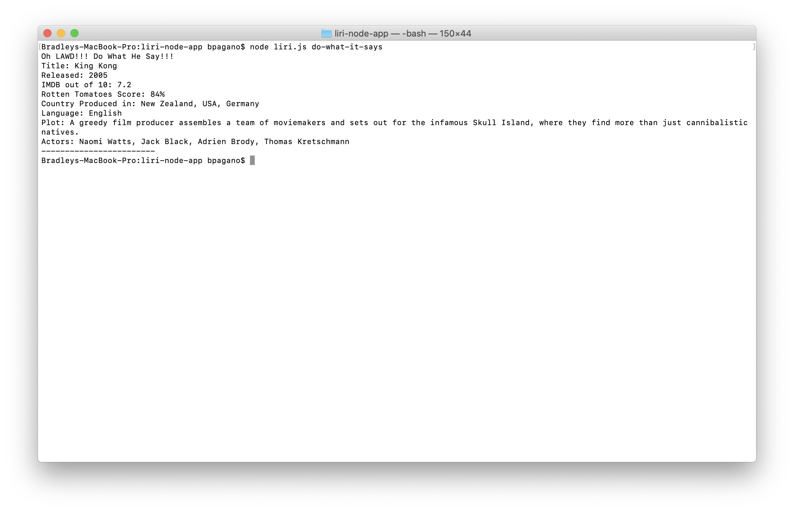

# liri-node-app

### Challenge laid out
I was tasked with making a command line interface that could call from a selecion of APIs
based on the type of input, I would call on a different website search

### How I accomplished the task
I created a switch case for each web search.  Based on what the user inputs in the command line.  Then, each switch case calls a get method from the selected API.

### Demo of the code

Please see the terminal commands and results below

above was the command for the concert search

above was the command for the movie search

above was the command for the spotify search

This was the phrase that was in the random.txt file to begin with

I then modified the random.txt

This was the result of the modified random.txt search
